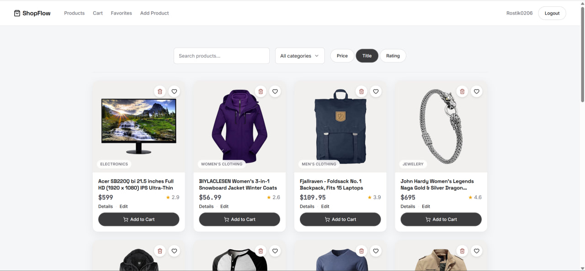
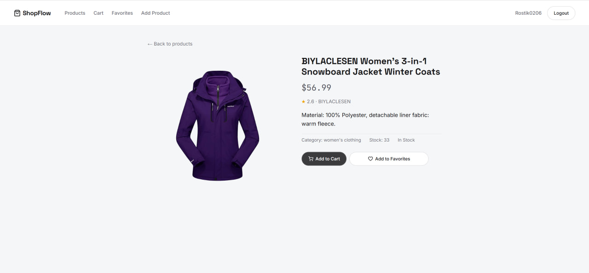
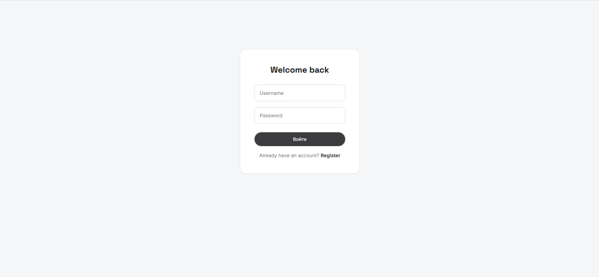
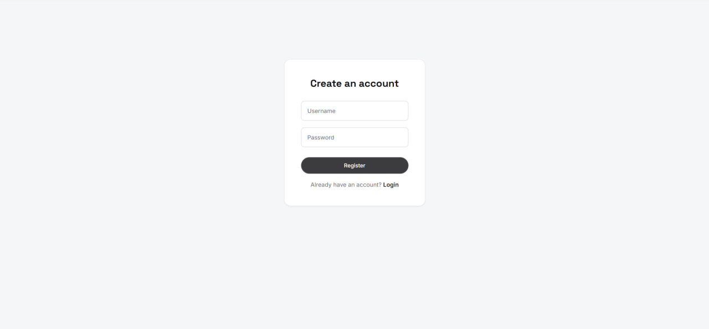
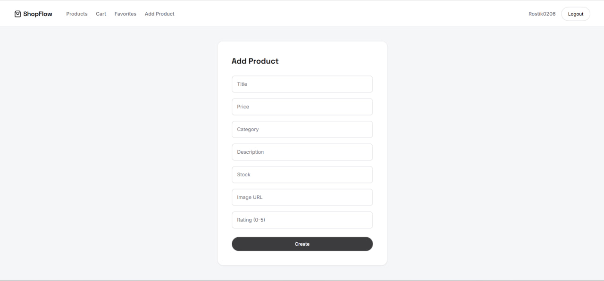
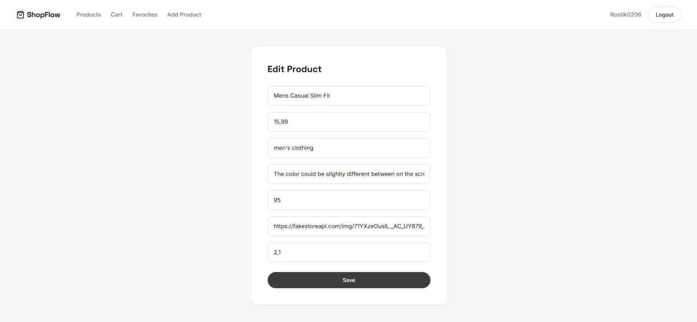
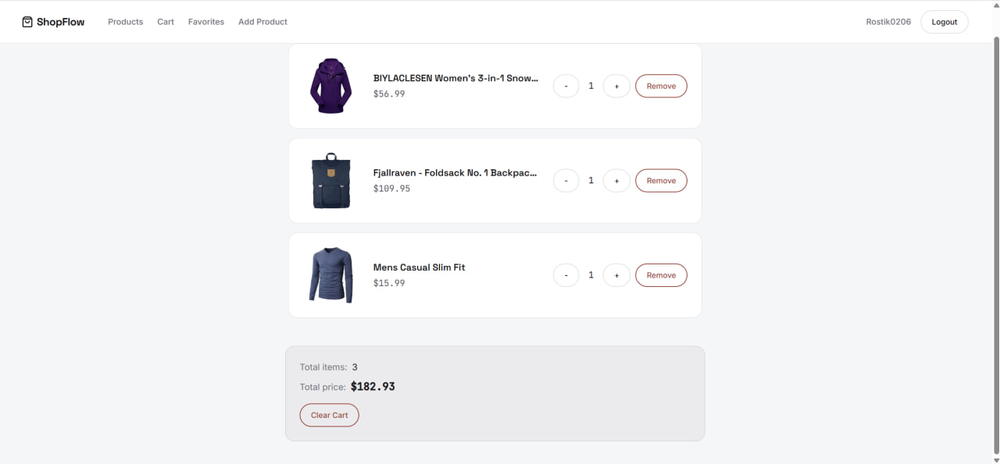
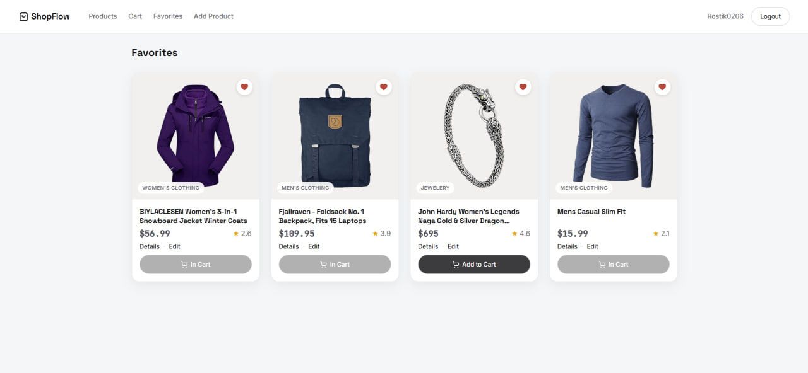

⚠️ The backend is hosted on Render's free tier and may take 30-60 seconds to wake up on the first request after inactivity.


# ShopFlow Pro

Fullstack e-commerce application built with React, TypeScript, Redux Toolkit, RTK Query, Node.js and Express.

ShopFlow Pro is a modern online store with authentication, product management, shopping cart, favorites and responsive UI.

The project demonstrates client-server architecture, state management, JWT authentication, REST API integration and modern frontend development practices.

## Live Demo

🌐 Frontend:
https://shopflow-pro-six.vercel.app/

⚙️ Backend API:
https://shopflow-pro-0ume.onrender.com

## Tech Stack

### Frontend

The application follows a feature-based architecture:

- components — reusable UI components
- features — business logic modules
- pages — application routes
- services — API communication
- store — Redux state management

- React 18
- TypeScript
- Redux Toolkit
- RTK Query (data fetching, caching and API state management)
- React Router v6
- SCSS Modules
- Vite
- Lucide React

### Backend

- Node.js
- Express
- TypeScript
- tsx
- JWT Authentication
- bcrypt password hashing
- CORS
- JSON-based data storage

### Deployment

- Vercel (Frontend)
- Render (Backend)

## Features

### Authentication

- User registration with validation
- Unique username checking
- User login/logout
- JWT authentication with expiration
- Protected routes
- Persistent authentication using localStorage
- Reactive authentication state with Redux Toolkit

### Product Catalog

- Server-side pagination
- Product search with debounce
- Category filtering
- Sorting by price, name and rating
- Ascending/descending sorting
- Product cards with category badges

### Product Management (CRUD)

- Create products
- Edit products
- Delete products
- Form validation
- Confirmation modals
- Optimistic UI updates with RTK Query cache updates

### Shopping Cart

- Add/remove products
- Quantity management
- Automatic item removal when quantity reaches zero
- Total price calculation
- Cart clearing confirmation
- Empty cart state

### Favorites

- Add/remove favorites
- Favorites page
- Empty state handling

## UI / UX

- Fully responsive design
- CSS Grid responsive product layout
- Sticky navigation bar
- Reusable UI components
- Modal windows using React Portal
- Loading and error states
- Custom SCSS design system
- CSS variables for colors, spacing and shadows

### Design

- Space Grotesk for headings
- Inter for body text
- JetBrains Mono for prices
- Pill-style buttons
- Animated interactions


## Screenshots

### Home Page

Main product catalog with search, filtering, sorting and responsive product grid.



---

### Product Details

Detailed product page with product information, favorites and product actions.



---

### Authentication

User login and registration with validation and JWT authentication.





---

### Product Management

Create and edit products with form validation and protected routes.





---

### Shopping Cart

Cart management with quantity control, total price calculation and empty state handling.



---

### Favorites

Favorites page with adding and removing products.




## Installation

### Clone the repository

```bash
git clone https://github.com/Rostik0602/shopflow-pro.git

Navigate to the project folder:

cd shopflow-pro
Install frontend dependencies
npm install
Install backend dependencies

Navigate to the server folder:

cd server

Install dependencies:

npm install
Environment Variables

Create a .env file in the root directory of the project:

VITE_API_URL=http://localhost:3000

This variable defines the backend API URL used by the frontend application.

Run the application

Start the backend server:

cd server

npm run dev

Start the frontend application in a separate terminal:

npm run dev

The application will be available at:

http://localhost:5173

The backend API will run at:

http://localhost:3000